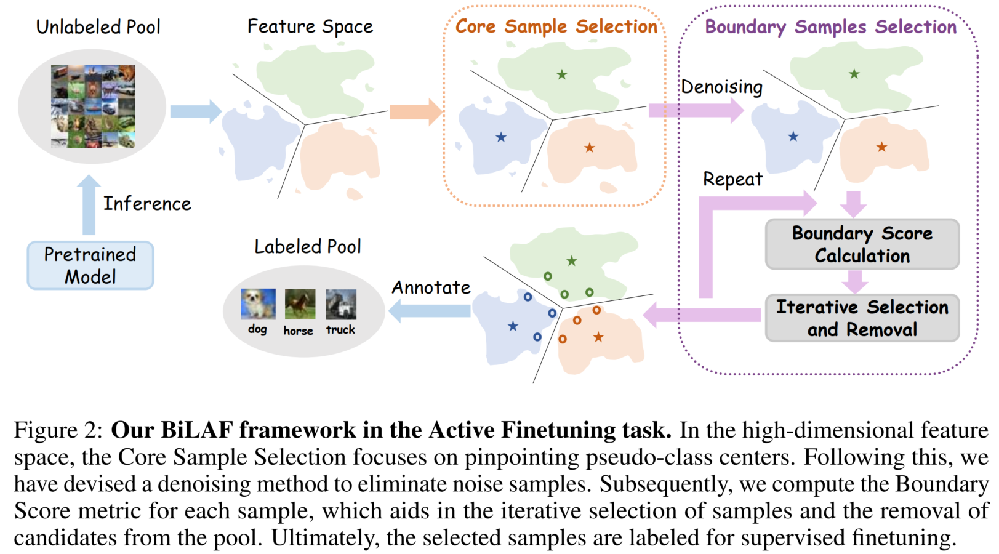

# Boundary Matters: A Bi-Level Active Finetuning Method (NeurIPS 2024)
## Abstract

The pretraining-finetuning paradigm has gained widespread adoption in vision tasks and other fields. However, the finetuning phase still requires high-quality annotated samples. To overcome this challenge, the concept of active finetuning has emerged, aiming to select the most appropriate samples for model finetuning within a limited budget. Existing active learning methods  struggle in this scenario due to their inherent bias in batch selection. Meanwhile, the recent active finetuning approach focuses solely on global distribution alignment but neglects the contributions of samples to local boundaries. Therefore, we propose a Bi-Level Active Finetuning framework (BiLAF) to select the samples for annotation in one shot, encompassing two stages: core sample selection for global diversity and boundary sample selection for local decision uncertainty. Without the need of ground-truth labels, our method can successfully identify pseudo-class centers, apply a novel denoising technique, and iteratively select boundary samples  with designed evaluation metric. Extensive experiments provide  qualitative and quantitative evidence of our method's superior efficacy, consistently outperforming the existing baselines.

[[paper link]](https://arxiv.org/abs/2403.10069)



## Installation

#### Environment

This codebase has been developed with CUDA 11.6, python 3.7.
```
conda create -n BiLAF python=3.7
source activate BiLAF
conda install pytorch==1.13.1 torchvision==0.14.1 torchaudio==0.13.1 pytorch-cuda=11.6 -c pytorch -c nvidia
conda install scipy
pip install timm==0.4.12
```

#### Data Preparation

If you experiment on CIFAR10 or CIFAR100, the dataset would be automatically downloaded to `data_selection/data` and `deit/data`. For [ImageNet](https://www.image-net.org/), you have to manually download it and link to `data_selection/data/ImageNet` and `deit/data/ImageNet`. 

## BiLAF Data Selection

#### Feature Extraction

Before data selection, you need to extract the features with a pretrained model. 

```
cd data_selection/
python extract_feature.py --dataset ${DATASET (one of the three: CIFAR10, CIFAR100 or ImageNet)}
```

Our default setting applies the DeiT-Small model pretrained with DINO ([ckpt](https://dl.fbaipublicfiles.com/dino/dino_deitsmall16_pretrain/dino_deitsmall16_pretrain.pth)). You can also specify other models in `data_selection/extract_feature.py`.

#### Core Sample Selection

With extracted features, you can select a subset from the dataset with the following command.

```
# For CIFAR10 or CIFAR100:
python Core_Selection/ActiveFT_CIFAR.py --feature_path ${PATH to the extracted feature} --percent ${sampling percentage}

# For ImageNet:
python Core_Selection/ActiveFT_ImageNet.py --feature_path ${PATH to the extracted feature} --percent ${sampling percentage}
```

### Boundary Sample Selection
Using the core samples selected in the previous step, you can further select boundary samples with the following command.

```
cd Boundary_Selection/

# For CIFAR10 or CIFAR100:
# python density_cluster.py --dataset ${CIFAR10 or CIFAR100} --indices_file_name ${PATH to the core samples} --cur_number ${number of core samples} --budget ${number of all samples}
python density_cluster.py --dataset CIFAR100 --indices_file_name ../subsets/CIFAR100/CIFAR100_train_ActiveFT_euclidean_temp_0.07_lr_0.001000_scheduler_none_iter_300_sampleNum_250.json 

# For ImageNet:
# python density_cluster_imagenet.py --dataset ImageNet --indices_file_name ${PATH to the core samples} --cur_number ${number of core samples} --budget ${number of all samples}
python density_cluster_imagenet.py --dataset ImageNet --indices_file_name ../subsets/ImageNet/ImageNet_train_ActiveFT_euclidean_temp_0.07_lr_0.001000_scheduler_none_iter_300_sampleNum_6405.json 

```

The Selected Samples of `BiLAF` are stored in the `data_selection/subsets` directory. You can use the subset id to run the following finetuning.

## Model Finetuning

We implement the model finetuning with our selected data subset based on the code base of [deit](https://github.com/facebookresearch/deit). You modify their code to allow the training on the selected subsets.

First, make sure you have downloaded the pretrained ViT model. In our default setting, we finetune the DeiT-Small model pretrained with DINO ([ckpt](https://dl.fbaipublicfiles.com/dino/dino_deitsmall16_pretrain/dino_deitsmall16_pretrain.pth)).

Then, you can run the following command to finetune the model.

```
cd deit/

# python -m torch.distributed.launch --nproc_per_node=2 --master_port 2222 --use_env main.py --clip-grad 2.0 --eval_interval 50 --data-set ${DATASET (one of the three: CIFAR10SUBSET, CIFAR100SUBSET or IMNETSUBSET)} --subset_ids ${JSON file for selected subset} --resume ${checkpoint (.pth) to be finetuned} --output_dir ${OUTPUT DIR}
python -m torch.distributed.launch --nproc_per_node=2 --master_port 2222 --use_env main.py --clip-grad 2.0 --eval_interval 50 --data-set CIFAR100SUBSET --subset_ids ../data_selection/subsets/CIFAR100/Density_1000_from_ActiveFT250.json --resume dino_deitsmall16_pretrain.pth --output_dir Outputs/
```

The finetuning process may be very sensitive to batch size or learning rate. To reproduce the number in the paper, we strongly recommend you to use the above command with 2 GPUs. If you prefer to finetune on a single GPU, you may need to double the batch size or half the learning rate.

## Acknowledgment

The code of this repo is developed based on [dino](https://github.com/facebookresearch/dino) and [deit](https://github.com/facebookresearch/deit). We sincerely thank the authors for making their projects open-source.

## Reference

If you find our work useful, please consider citing the following paper: 

```bibtex
@article{lu2024boundary,
  title={Boundary Matters: A Bi-Level Active Finetuning Framework},
  author={Lu, Han and Xie, Yichen and Yang, Xiaokang and Yan, Junchi},
  journal={arXiv preprint arXiv:2403.10069},
  year={2024}
}
```

